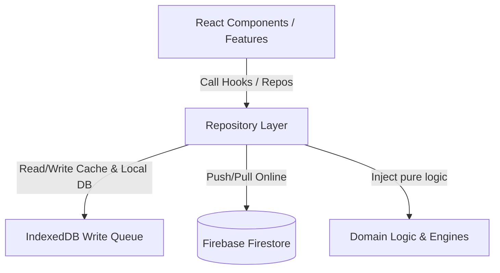

# Technical Architecture & Features Guide: Vibe Gym PWA

Vibe Gym è una PWA (Progressive Web App) di livello enterprise concepita per atleti e personal trainer, ottimizzata per scenari offline tipici delle sale pesi (strutture in cemento armato con scarsa ricezione).

---

## 🏗️ Architettura & Design Pattern

L'applicazione adotta una rigorosa separazione delle responsabilità strutturata su tre livelli principali:



### 1. Domain Layer (`src/core/domain/`)
Contiene il "motore" puro dell'applicazione. È interamente scritto in TypeScript puro (senza dipendenze da React o Firestore), garantendo testabilità isolata ed indipendenza tecnologica. 
*   **AI Coaching Engine (`coachingEngine.ts`)**: Implementa le logiche di Progressive Overload deterministiche.
*   **Estimator Factory (`estimators/`)**: Seleziona dinamicamente le formule per la stima del massimale teorico (1RM) in base alle ripetizioni target:
    *   *Formula Brzycki*: Utilizzata per ripetizioni target $\le 10$.
    *   *Formula Lombardi*: Utilizzata per ripetizioni target $> 10$.
    *   *Formula Epley*: Utilizzata come fallback generale.
*   **Calisthenics Hypertrophy Caps**: Definisce tetti massimi di ripetizioni a corpo libero (Tirata: 12 rep, Spinta: 20 rep, Gambe: 15 rep) oltre i quali suggerisce l'uso della zavorra aggiuntiva.
*   **NSCA Strength Standards**: Associa i massimali calcolati a parametri NSCA in base al peso corporeo, escludendo esercizi guidati (macchine) o a corpo libero non zavorrati per non falsare le valutazioni.

### 2. Repository Layer (`src/repositories/`)
Funge da mediatore tra il dominio e i database (Firestore / IndexedDB local cache). 
*   **In-Memory Caching**: Tutti i repository integrano una cache in memoria con un TTL di 5 minuti, riducendo drasticamente il numero di letture (e i relativi costi) su Firebase Firestore.
*   **Barrel Exports (`src/repositories/index.ts`)**: Unifica i punti di accesso ai dati dell'app (`AuthRepository`, `LogsRepository`, `WorkoutsRepository`, `UsersRepository`, `SessionsRepository`, `PersonalRecordsRepository`).

### 3. Offline-First & Sync Engine (`src/offline/`)
Per garantire il corretto funzionamento e zero perdite di dati in assenza di rete:
*   **IndexedDB Local Storage (`indexedDB.ts`)**: Inizializza il database locale `VibeGymOfflineDB` (v1) con due store principali:
    1.  `activeSession`: Salva in tempo reale lo stato attivo del workout in corso (timer, ripetizioni digitate, set completati) associandolo all'utente.
    2.  `writeQueue`: Coda transazionale FIFO (First-In, First-Out) in cui vengono archiviati i payloads structurali dei log (`logSet`, `deleteLog`, `updateLog`, `saveSessionSummary`).
*   **Real-time Sync Engine (`syncEngine.ts`)**:
    *   Rileva automaticamente il ritorno della connettività (`online`).
    *   Processa i messaggi accodati in IndexedDB in sequenza.
    *   **Exponential Backoff**: In caso di rete instabile o errore temporaneo di Firebase, pianifica i tentativi di invio raddoppiando il tempo di attesa da 2s a un maximmo di 30s.
    *   **Conflict Resolution**: Applica una strategia di *Last Write Wins* confrontando i metadati temporali (`clientTimestamp`) inviati dal client con i dati presenti su Firestore.

### 4. Strategia di Archiviazione dei Dati (Hot/Cold Data Layering)
Per non sforare il limite di 1MB imposto da Firestore su singolo documento e mantenere elevata la velocità di caricamento:
*   **Hot Path**: I log recenti (ultimi 30 giorni) sono salvati come singoli documenti separati in Firestore (`users/{userId}/logs`).
*   **Cold Path**: I log più vecchi di 30 giorni vengono compressi e accorpati in snapshot mensili archiviati in un array (`users/{userId}/history_snapshot/{month}`).
*   **Salvaguardie**:
    *   **Daily Throttle**: Massimo una compressione al giorno per utente.
    *   **Lock Concorrenziale**: Impedisce ad altri dispositivi attivi dello stesso utente di lanciare la compressione contemporaneamente.
    *   **Automatic Sharding**: Limita ogni documento di snapshot a 2000 log (~300KB) per prevenire sforamenti fisici di dimensione.

---

## 🌟 Funzionalità Chiave dell'App

### 🏃 Per l'Atleta (Client)
*   **Workout Logger Avanzato**:
    *   Permette la digitazione rapida di Carico, Reps e RPE (scala di sforzo percepito 1-10).
    *   Gestione nativa dei **Superset** con passaggio istantaneo tra esercizi correlati e timer di riposo specifici.
    *   Identificazione e tracciamento automatico delle serie saltate (*Skipped*).
*   **Generatore di Warm-Up RAMP**:
    *   Calcola in automatico un riscaldamento personalizzato in 3 fasi basandosi sulla prima serie target dell'esercizio fondamentale:
        1.  *Mobilità / Lubrificazione* (basso sforzo).
        2.  *Attivazione CNS* (velocità esecutiva e rep medie).
        3.  *Acclimatamento al carico* (1-2 singole pesanti vicino al carico allenante).
*   **Calcolatore Dischi (Plate Calculator)**:
    *   Mostra graficamente i dischi precisi da caricare su ciascun lato del bilanciere.
    *   Supporto per diverse barre: **Olimpico (20kg)**, **Powerlifting (25kg)**, **EZ (8kg)**, **Multipower/Smith (11kg)**, e **Corpo Libero/Macchina (0kg)**.
    *   Impostazione personalizzata del parco dischi disponibile in palestra salvata localmente.
*   **Session Recovery (Anti-Crash)**:
    *   Se l'app o il browser si chiudono improvvisamente, al riavvio (entro un intervallo di 4 ore) viene proposto il ripristino automatico dell'esatto stato del workout.
*   **Archivio Storico & Badge NSCA**:
    *   Mappe di calore stile GitHub per valutare la costanza degli allenamenti.
    *   Grafici radar per verificare la distribuzione del volume muscolare.
    *   Valutazione scientifica del proprio livello atletico.
*   **Condivisione Social & PiP Video**:
    *   Esporta card grafiche dei traguardi raggiunti con QR Code e statistiche incorporate.
    *   Video Player Picture-in-Picture fluttuante e trascinabile per guardare i video tutorial dell'esercizio mentre si compila il log.

### 🧢 Per il Personal Trainer (PT Dashboard)
*   **Gestione Atleti**: Collegamento istantaneo tramite codice invito generato dal PT.
*   **Libreria Esercizi**: Creazione e modifica di schemi motori generali o privati, con link a video YouTube.
*   **Analisi Carico Interno ed ACWR**:
    *   **ACWR (Acute-to-Chronic Workload Ratio)**: Rapporto tra carico acuto (fatica degli ultimi 7 giorni) e cronico (fitness degli ultimi 28 giorni). Se supera 1.5, segnala visivamente il rischio infortunio (*Danger Zone*).
    *   **Rapporto Fatica-Volume**: Sovrappone il tonnellaggio complessivo sollevato all'RPE medio stimato per identificare se l'atleta si sta sotto-allenando o sovra-allenando.

---

## 🎨 UI/UX & Design Premium

L'applicazione sfoggia un'interfaccia estremamente raffinata e performante:
*   **OLED-True Dark Mode**: Sfondi neri profondi per ridurre i consumi su schermi OLED e migliorare la leggibilità sotto le luci della palestra.
*   **Glassmorphism**: Pannelli traslucidi con sfocatura dello sfondo (`backdrop-blur-md bg-gray-900/80`) impreziositi da sottili bordi luminosi ciano e blu.
*   **Transizioni Fluide**: Gestite tramite `framer-motion` per ingressi, modal ed eliminazione rapida delle serie tramite swipe.

---

## 🌐 PWA & Traduzione Bilingue (i18n)

*   **Offline Nativo**: Configurato tramite `vite-plugin-pwa` con politiche di cache mirate:
    *   `NetworkFirst` (con timeout a 4s) per le API Firebase/Firestore.
    *   `CacheFirst` (30 giorni) per gli asset statici e i Google Fonts.
*   **Bilingue Real-time**: Architettura interna con context `i18n.tsx` per la traduzione istantanea di tutti i testi e delle frasi dinamiche calcolate dal motore dell'AI in Inglese e Italiano.

---

## 📁 Struttura delle Cartelle del Progetto

```text
src/
├── app/                  # Entry point dell'app e configurazione rotte
├── components/           # Componenti grafici globali (bottoni, input, modali)
├── config/               # Parametri di configurazione d'ambiente
├── core/                 # Logica di dominio pura
│   ├── domain/           # Algoritmi AI, calcolo 1RM, livelli NSCA
│   └── warmup/           # Logica riscaldamento e calcolo dischi
├── date/                 # Utility per date fusi orari locali
├── features/             # Moduli funzionali dell'applicazione
│   ├── admin/            # Pannello di amministrazione PT/Clienti
│   ├── auth/             # Login, Registrazione e Reset password
│   ├── dashboard-client/ # Dashboard atleta e grafici di progresso
│   ├── dashboard-pt/     # Dashboard personal trainer e statistiche atleti
│   ├── profile/          # Gestione dati personali e misurazioni corporee
│   └── workout/          # Logger sessioni pesi, superset e timer
├── hooks/                # Custom React Hooks condivisi
├── offline/              # Configurazione IndexedDB e motore di sincronizzazione
├── repositories/         # Interfaccia di astrazione per l'accesso ai dati (Firestore)
├── schemas/              # Validazioni Zod
├── services/             # Configurazione Firebase, i18n e Tema scuro/chiaro
├── store/                # Gestione globale degli stati (Zustand)
├── tests/                # Unit test (Vitest)
├── types/                # Definizioni dei tipi TypeScript
├── utils/                # Helper di utilità generale
└── workers/              # Web Worker per il calcolo dei timer in background
```

---

## ⚙️ Setup di Sviluppo Locale

### Requisiti
*   Node.js v18+
*   Progetto Firebase attivo (con Authentication e Firestore configurati)

### Installazione
1.  Clona la repository ed entra nella cartella:
    ```bash
    git clone https://github.com/your-repo/vibegym33.git
    cd vibegym33
    ```
2.  Installa i pacchetti:
    ```bash
    npm install
    ```
3.  Crea un file `.env` nella root del progetto con le tue credenziali Firebase:
    ```env
    VITE_FIREBASE_API_KEY=tua_api_key
    VITE_FIREBASE_AUTH_DOMAIN=tuo_auth_domain
    VITE_FIREBASE_PROJECT_ID=tuo_id_progetto
    VITE_FIREBASE_STORAGE_BUCKET=tuo_bucket_storage
    VITE_FIREBASE_MESSAGING_SENDER_ID=tuo_sender_id
    VITE_FIREBASE_APP_ID=tua_app_id
    ```
4.  Avvia l'ambiente locale:
    ```bash
    npm run dev
    ```

> [!TIP]
> Se desideri testare l'interfaccia o le funzionalità grafiche senza configurare Firebase, puoi attivare la modalità mockup impostando `VITE_USE_MOCK=true` nel tuo file `.env`. L'applicazione utilizzerà un database locale simulato (`mockFirebase.ts`) precaricato con dati dimostrativi.
